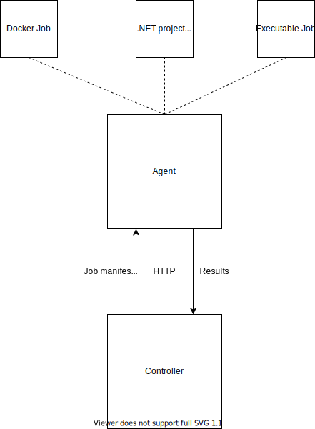

# Architecture

The benchmarking infrastructure is a simple client-server design. The benchmark controller orchestrates jobs across one or more agents and polls for status.

The agent runs on each machine that wants to execute jobs and has exposes a simple CRUD HTTP API that can be used to manage the queue of jobs. The job queue on the agent side executes jobs serially.

See the [diagram](#diagram) for more details.

## Jobs, Scenarios, and Profiles

Jobs are individual units of execution. A job can be encapsulated by a Dockerfile, or a .NET project. Scenarios are a list of jobs that the controller will orchestrate.

```yaml
imports:
    - https://raw.githubusercontent.com/aspnet/Benchmarks/master/src/BombardierClient/bombardier.yml

jobs:
  server:
    source:
      repository: https://github.com/aspnet/perf
      branchOrCommit: master
      project: samples/hello/hello.csproj

scenarios:
  hello:
    application:
      job: server
    load:
      job: bombardier
      variables:
        serverPort: 5000
        path: /
```

In the above manifest, there are 2 jobs defined:
1. The "server" job
2. The "bombardier" job (defined in the imports section)

The server job runs a hello world ASP.NET Core application and the bombardier job is a benchmarking tools with specific variables defined to exert load on the server job. We specify a variable called serverPort to tell the client what port to hit on the server job.

## Diagram

<p align="center">
    
</p>
